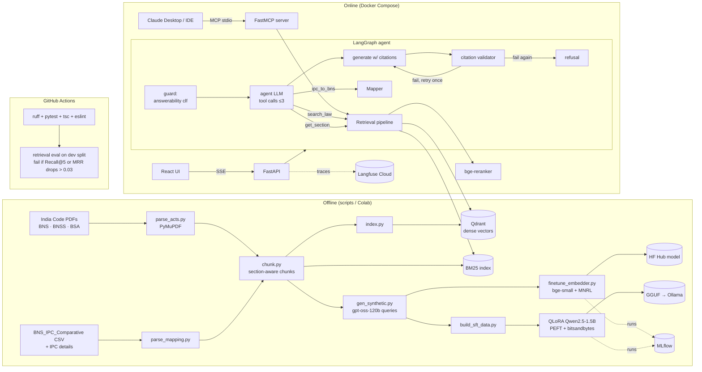

# NyayaRAG: build plan

Citation-grounded legal Q&A over India's new criminal laws, plus an IPC-to-BNS section mapper.
This is the project behind the ML / AI Engineer resume (`../resume_ml.tex`). Target: about 3–4 weeks part-time (~80 hours), built in **6 phases** (§7).
Data: the official Act texts from India Code are the ground truth. Eight Kaggle datasets speed up the build and strengthen the evaluation; see "Data at a glance" in §3.

> **Product disclaimer (show it in the UI, the API response footer, the MCP tool descriptions and the README):**
> "NyayaRAG gives general information about the text of the BNS, BNSS and BSA. It is not legal advice, may be wrong or out of date, and is no substitute for a qualified lawyer. Always read the official Act text."

---

## 0. Status and ground rules

### 0.0 Phase status

Update this table at the end of every phase (see `CLAUDE.md`). Details of each phase go in `PROGRESS.md`.

| Phase | Name | Status | Resume claims it unlocks | Done on |
|---|---|---|---|---|
| P1 | Foundation: repo, data, parser, chunker, mapper | ⬜ Not started | "all 1,059 sections", "section-aware chunking", "IPC-to-BNS mapper" | |
| P2 | Golden set, eval harness, BM25 + dense baselines (Qdrant) | ⬜ Not started | "hand-verified 130-question test set", "0.62 (BM25)" | |
| P3 | Embedding fine-tune, hybrid RRF, reranker, ablations (MLflow) | ⬜ Not started | "Recall@5 … to 0.85", "fine-tuning bge-small in PyTorch on 3,000+ pairs", "cross-encoder reranker", "MLflow-tracked" | |
| P4 | Generation, citation validator, answerability gate, LangGraph agent, RAGAS | ⬜ Not started | "0.90+ RAGAS faithfulness", "refused 90%+", "LangGraph tool-calling agent", "scikit-learn answerability classifier" | |
| P5 | Serving: FastAPI SSE, Docker, Langfuse, MCP, React UI, CI eval gate | ⬜ Not started | "streaming FastAPI + Docker service with Langfuse tracing, a CI eval gate and an MCP server" | |
| P6 | QLoRA small model + ship (README, demo, resume numbers) | ⬜ Not started | "citation-format compliance from 68% to 96% by QLoRA-tuning Qwen2.5-1.5B (PEFT, bitsandbytes)" | |

Legend: ⬜ Not started · 🟨 In progress · ✅ Done · ✂️ Cut (see §7 cut rules)

### 0.1 Ground rules (for you and for any AI coding agent)

1. **The resume is the spec.** The four bullets in §10 are what this project must make true. Every number is either a design fact you must build or a **VERIFY** number you must measure (§9). After building, replace targets on the resume with measured values; never the other way round.
2. **India Code text is the only ground truth.** Kaggle data is for fast start, cross-checks and external test slices; it is never cited as the law and never indexed in the final build.
3. **One phase per session.** An agent implements a whole phase in one pass (all backend and UI work listed under it), runs the tests, then stops with a summary and manual-testing steps. The developer verifies the phase's "Done when" list before starting the next phase. The exact agent workflow is in `CLAUDE.md`.
4. **Tests before code.** Write the tests named in each phase before the code they test. Never skip, weaken or delete a test to make it pass.
5. **Numbers in §3 are sanity checks, not constants.** Never hard-code them except in the explicit count assertions (358 / 531 / 170 / 1,059). If output disagrees, find out why.
6. **Dev/test discipline.** Tune on the golden **dev** split only. Run **test** once per final config, logged with git SHA.
7. **Human-only tasks stay human.** Golden questions, two-pass verification, hand-labelling, hand-grading and judge-agreement labels are written by the developer, not generated by an LLM. Agents build the tooling around them. Each phase lists its 🧑 human tasks.
8. **No paid or long jobs without asking.** Groq bulk calls (synthetic data, RAGAS, SFT teacher), Colab/Kaggle GPU training and Docker image builds are run by the developer from commands the agent provides.
9. **Keep `DECISIONS.md`** (what you chose and why). Interviewers will ask; you must be able to explain every line you ship.
10. **Markdown formatting:** keep code identifiers in backticks; editors that auto-format Markdown can mangle double underscores in tables.

### 0.2 Kaggle account and API token
Eight of the datasets in §3 are on Kaggle. The Act PDFs (India Code) and the government comparison tables need no account.
1. Create a free account at https://www.kaggle.com and verify your phone number (some downloads require it).
2. Kaggle → profile → **Settings** → **API** → **Create New Token**. This downloads `kaggle.json`.
3. Put it at `%USERPROFILE%\.kaggle\kaggle.json` on Windows (`~/.kaggle/kaggle.json` on Linux/macOS, `chmod 600`). For CI, use the `KAGGLE_USERNAME` and `KAGGLE_KEY` environment variables / GitHub Actions secrets.
4. `pip install kaggle`, then test with `kaggle datasets list -s bns`.
5. On some datasets, open the dataset page once in the browser and accept the terms before the API will download it.
6. **Never commit `kaggle.json` or any key.** `kaggle.json`, `.env` and `backend/data/raw/` are in `.gitignore` from P1.
7. The download script fails with a clear message ("Kaggle token not found: see PLAN.md §0.2") instead of a stack trace.

### 0.3 Licences: never commit raw data

| Dataset (§3 #) | Licence | What it means here |
|---|---|---|
| Act PDFs, government comparison tables (#1, §3a) | Government text | Cite India Code; link, don't re-host |
| BNS / BSA CSVs, `nandr39` (#2, #3) | CC BY-SA 4.0 | Attribute; share-alike |
| BNSS JSON and BNS-IPC mapping, `tanujsaxena` (#4, #5) | MIT | Permissive; credit anyway |
| FIR-relevant mapping, `sirjon` (#6) | CC BY-SA 4.0 | Attribute; share-alike |
| IPC sections, `dev523` (#7) | Apache 2.0 | Permissive; credit anyway |
| Old-law QA pairs, `akshatgupta7` (#8) | CC BY-SA 4.0 | Attribute; share-alike. Your re-labelled `ext_oldlaw_v1` is derived from it, so don't commit it unless you license that file CC BY-SA |
| IndicLegalQA (#9) | CC BY-NC-SA 4.0 | Non-commercial; share-alike. Same rule for `ext_ood_v1` |

Models published to the Hugging Face Hub (fine-tuned embedder, QLoRA adapter) were trained on synthetic queries over government text, so they're fine to share. Say in their model cards which data they were trained on.

Rules for the repo:
- `backend/data/raw/` (and any processed copy of third-party data) is gitignored. `scripts/download.py` fetches everything reproducibly and records file hashes.
- Several sources are **share-alike** (CC BY-SA, CC BY-NC-SA); **non-commercial** sources must not be used in anything sold. Not committing data avoids both problems.
- Code is MIT. The README says data is not covered by the code licence and has a **Data credits** table: dataset, link, author, licence, use.

### 0.4 Keep the resume true
- Don't rename the project, its repo (`github.com/SudevOP1/NyayaRAG`) or the headline tech stack (PyTorch, Hugging Face, Qdrant, LangGraph, FastAPI, Docker, MLflow) without updating the resume.
- Every resume number traces to a committed results JSON (§9).

---

## 1. Pitch

**One paragraph.** India replaced the Indian Penal Code, the CrPC and the Indian Evidence Act with three new laws, in force since 1 July 2024: the Bharatiya Nyaya Sanhita (BNS), the Bharatiya Nagarik Suraksha Sanhita (BNSS) and the Bharatiya Sakshya Adhiniyam (BSA). Together they have 1,059 sections. Students, journalists and citizens still think in old section numbers ("IPC 420", "CrPC 438"). NyayaRAG answers questions about the new laws using only their text. Every legal statement carries a section citation such as `[BNS 103(1)]`. It refuses when the retrieved text does not support an answer, and it maps old IPC sections to their BNS equivalents using a government-published correspondence table. Under the hood: section-aware chunking, a hybrid BM25 + dense retriever (Qdrant) fused by RRF with a bge-small embedder fine-tuned in PyTorch on synthetic queries, a cross-encoder reranker, a LangGraph tool-calling agent, a citation validator, a scikit-learn answerability gate, and a QLoRA-tuned Qwen2.5-1.5B for offline use. It is served through a streaming FastAPI service in Docker, an MCP server and a React UI, traced in Langfuse, with experiments in MLflow. A hand-verified evaluation harness (retrieval ablations, RAGAS, latency) runs as a CI regression gate.

**Two lines.** NyayaRAG is a citation-grounded legal assistant over all 1,059 sections of India's new criminal laws (BNS, BNSS, BSA), with an IPC-to-BNS mapper. It combines a fine-tuned hybrid retriever, a LangGraph agent that refuses when an answer is ungrounded, and a QLoRA small model, all measured by a hand-verified eval harness gated in CI.

## 2. Why this project, for ML and GenAI hiring

Current (2025–26) AI-engineer job descriptions ask for: RAG, embeddings, vector databases, hybrid search, reranking, fine-tuning (LoRA/QLoRA/PEFT), PyTorch and Hugging Face, agents and tool calling (LangGraph), MCP, LLM evaluation (hallucination and faithfulness), observability, Docker, CI and FastAPI serving.

| What interviewers probe | Where NyayaRAG shows it | Phase |
|---|---|---|
| "Have you trained anything, or only called APIs?" | Embedding fine-tune (MNRL in sentence-transformers plus a from-scratch PyTorch loss), QLoRA SFT with PEFT and bitsandbytes | P3, P6 |
| "How do you know it works?" | Frozen, hand-verified golden set; dev/test split; ablation table with bootstrap CIs; RAGAS with a judge-agreement check; CI gate | P2–P5 |
| "How do you stop hallucinations?" | Mandatory citations, citation validator, scikit-learn answerability classifier, refusal template | P4 |
| "Can you ship it?" | Streaming FastAPI, Docker Compose, Langfuse traces, GitHub Actions, MCP server, React UI | P5 |
| "Agents?" | LangGraph graph with tools (search, section lookup, IPC-to-BNS), bounded loops, validator node | P4 |

The laws are new and Indian, so the domain shift from general web data is real and fine-tuning the retriever is justified rather than decorative.

## 3. Verified facts and data sources

All checked on 2026-10-07. Re-check the links at the start of P1.

### Data at a glance

**Rule: the official India Code text is the only ground truth.** Kaggle datasets are community-made: they get you running on day 1, cross-check your parser, and give you outside test questions, but they are never cited as the law.

| # | Dataset | Where | Licence | Role | Verified facts (2026-10-07) |
|---|---|---|---|---|---|
| 1 | **BNS, BNSS, BSA official text** | India Code PDFs (§3a) | Government text | **Ground truth** for corpus and citations | 358 / 531 / 170 sections |
| 2 | **BNS sections (CSV)** | Kaggle `nandr39/bharatiya-nyaya-sanhita-dataset-bns`, `bns_sections.csv` | CC BY-SA 4.0 | Day-1 fast start; parser cross-check | **358 rows**, chapters 1–20. Columns `Chapter`, `Chapter_name`, `Chapter_subtype`, `Section`, `Section _name` (stray space), `Description`. Keeps `(1)`, `(2)`; `\r\n` breaks; stray footnote digits ("date1"). One duplicated description |
| 3 | **BSA sections (CSV)** | Kaggle `nandr39/bharatiya-sakshya-adhiniyam-dataset-bsa`, `bsa_sections.csv` | CC BY-SA 4.0 | Same, for BSA | **170 rows**, chapters 1–12. **3 rows have empty `Description`**; fill from PDF |
| 4 | **BNSS (JSON)** | Kaggle `tanujsaxena/the-bharatiya-nagarik-suraksha-sanhita-2023` | MIT | Cross-check BNSS titles only | ~216 KB; count unverified, assert 531 after download. Same author's BNS file loses sub-section numbering, so **parse BNSS yourself** |
| 5 | **IPC ↔ BNS correspondence (CSV)** | Kaggle `tanujsaxena/bns-ipc-mapping`, `BNS_IPC_Comparative.csv` | MIT | **Mapper source** | **578 rows**. Columns `BNS_Section` (e.g. `2(8)`), `BNS_Title`, `Status`, `IPC_Section`, `IPC_Title`. `Status`: blank 405 (carried over), `Change` 136, `Deleted` 19, `New Section` 10, `New Sub-Section` 8. 534 distinct BNS refs, 551 distinct IPC refs. Same layout as the UP Police government table (§3a) |
| 6 | **FIR-relevant mapping (CSV)** | Kaggle `sirjon/bns-correspondence` | CC BY-SA 4.0 | Independent cross-check of #5; regression tests | 150 BNS sections across 9 offence chapters. Flags 9 commonly confused mappings (e.g. cheating is BNS 318, not 316) |
| 7 | **IPC section details (CSV)** | Kaggle `dev523/indian-penal-code-ipc-sections-information`, `ipc_sections.csv` | Apache 2.0 | Old-law side of the mapper (name, punishment) | **444 rows** (442 distinct). Columns `Description`, `Offense`, `Punishment`, `Section` (`IPC_140`). 57 `Offense="nan"`, 58 `Punishment="nan"` |
| 8 | **Old-law Q&A pairs (JSON)** | Kaggle `akshatgupta7/llm-fine-tuning-dataset-of-indian-legal-texts`: `ipc_qa.json`, `crpc_qa.json` | CC BY-SA 4.0 | **External test slice 1** (old-law phrasing, re-labelled to BNS/BNSS) | `ipc_qa.json` ~480 items; `crpc_qa.json` 2.2 MB. Some pairs out of context; filter |
| 9 | **IndicLegalQA** | Kaggle `kmldas/indiclegalqa-dataset` (Mendeley DOI 10.17632/gf8n8cnmvc.2) | CC BY-NC-SA 4.0 | **External test slice 2** (out-of-scope refusals) | 10,000 Q&A pairs from 1,256 SC judgments (538 criminal, 718 civil) |

### 3a. The Acts and the official correspondence table

| Fact | Value | Source |
|---|---|---|
| BNS, 2023 (Act 45 of 2023), replaces IPC | **358 sections, 20 chapters** | https://www.indiacode.nic.in/handle/123456789/20062 (PDF: https://www.indiacode.nic.in/bitstream/123456789/20062/1/a202345.pdf) |
| BNSS, 2023 (Act 46 of 2023), replaces CrPC | **531 sections, 39 chapters**, plus First Schedule (classification) and Second Schedule (forms) | PDF: https://indiacode.nic.in/bitstream/123456789/20099/3/a2023-46.pdf |
| BSA, 2023 (Act 47 of 2023), replaces Evidence Act | **170 sections, 12 chapters** | https://indiacode.nic.in/handle/123456789/20063 (PDF: https://www.indiacode.nic.in/bitstream/123456789/20063/1/aa202347.pdf) |
| Total corpus | **1,059 sections** | Asserted by the parser tests (P1) |
| Dates | Assent 25 Dec 2023; notified 24 Feb 2024; **in force 1 July 2024, except BNS s.106(2)** (hit-and-run) | https://www.business-standard.com/india-news/three-laws-replacing-ipc-crpc-evidence-act-to-be-effective-from-july-1-124022400420_1.html |
| IPC-to-BNS correspondence table | "Correspondence Table and Comparison Summary of the BNS, 2023 to the IPC, 1860", CAPT Bhopal (confirm affiliation on https://bprd.nic.in/page/training before writing it in the README) | https://www.keralaprisons.gov.in/userfiles/act-and-rules/comparison_summary_BNS_to_IPC.pdf ; BNSS↔CrPC: https://keralaprisons.gov.in/userfiles/act-and-rules/comparison_summary_BNSS_to_CrPC.pdf |
| Second government copy | UP Police "BNS_IPC_Comparative" (same layout as Kaggle #5) | https://uppolice.gov.in/site/writereaddata/siteContent/Three%20New%20Major%20Acts/202406281710564823BNS_IPC_Comparative.pdf |
| Cross-check source | NCRB "Sankalan of Criminal Laws" app (13 June 2024) | https://www.newsonair.gov.in/ncrb-launches-mobile-app-ncrb-sankalan-of-criminal-laws-new-criminal-laws-to-come-into-force-from-july-1 |

**Honesty note for the README.** The correspondence table is a government-academy reference document, not a statutory schedule. Call it "a government-published correspondence table", hand-check a sample against NCRB Sankalan, and never call it "the official mapping".

### 3b. Considered and not used

| Dataset | Why not |
|---|---|
| Kaggle `shreyansh00singh/indian-statutory-law-reasoning-benchmark` | Templated LLM-style questions, only 742 of 1,074 unique, mixes in non-criminal and Pakistani law |
| Kaggle `tanujsaxena/the-bharatiya-nyaya-sanhita-2023` (BNS JSON) | Loses sub-section numbers, mis-splits text. #2 is cleaner |
| HF `jbp123/bns` | Keyed to Bill numbering, which may not match the Act |
| Kaggle `alpie/indian-law` and similar | Mostly pre-2024 IPC-era case law; off-target |

### 3c. Model and API facts that changed recently
- Groq retired `llama-3.1-8b-instant` and `llama-3.3-70b-versatile` for free/developer tiers on **16 Aug 2026**. Use `openai/gpt-oss-20b` and `openai/gpt-oss-120b` (https://console.groq.com/docs/deprecations). Model IDs live in config.
- Groq free tier per model: 30 RPM, 8K TPM, 1K RPD, **200K tokens/day**. Developer tier gpt-oss-120b ≈ $0.15 / $0.60 per 1M in/out tokens (confirm on groq.com). Total project LLM spend should stay under **$3**.
- Langfuse Cloud "Hobby" (free): 50k units/month, 30-day retention. Use Cloud, not self-host.
- RAGAS 0.2+ metric classes: `Faithfulness`, `ResponseRelevancy`, `LLMContextPrecisionWithReference`, `LLMContextRecall`; custom judge via `LangchainLLMWrapper`.

## 4. Tech stack

| Layer | Choice | Why | Fallback |
|---|---|---|---|
| PDF parsing | **PyMuPDF** (`get_text("dict")`), `rapidfuzz` for cross-checks | Font, size, coordinates for marginal notes and headers | pdfplumber |
| Sparse retrieval | **rank_bm25** (BM25Okapi), legal-aware tokenizer | Exact section numbers and terms of art matter | Qdrant sparse vectors (stretch) |
| Dense retrieval | **BAAI/bge-small-en-v1.5** (33M, 384-d), fine-tuned | Fast on CPU, fine-tunes in minutes on a T4 | bge-base-en-v1.5 |
| Vector DB | **Qdrant** (Docker; local mode `QdrantClient(path=...)` in tests/CI) | Named vectors (base vs FT), payload filters | — |
| Fusion | **Reciprocal Rank Fusion** (own implementation, k tuned on dev) | Scale-free | Qdrant `Fusion.RRF` (stretch) |
| Reranker | **BAAI/bge-reranker-base** cross-encoder | Strong, CPU-viable on top-20 | `cross-encoder/ms-marco-MiniLM-L-6-v2` |
| Training | **PyTorch**, **sentence-transformers**, **Hugging Face Transformers**, **PEFT**, **bitsandbytes**, **TRL**, HF Hub | Industry standard | — |
| Compute | Free **Colab T4** or **Kaggle** GPUs. T4 has **no bf16**: use fp16 | Free | — |
| Experiment tracking | **MLflow** (file store; `mlflow ui` locally) | Params, metrics, artifacts per run | — |
| Classic ML | **scikit-learn**, pandas, NumPy | Calibrated refusal, eval tables, bootstrap | — |
| LLMs | **Groq** `openai/gpt-oss-20b` (answers), `openai/gpt-oss-120b` (synthetic data, judge, SFT teacher); **Ollama** `qwen2.5:1.5b-instruct` + QLoRA GGUF (offline) | Free/cheap, open-weight | Ollama `qwen2.5:7b-instruct` |
| Orchestration | **LangGraph** + LangChain core (`@tool`, `ChatGroq`, `ChatOllama`) | Tool-calling agent with validator node | — |
| Evaluation | Own retrieval harness (Recall@k, MRR, nDCG, bootstrap CIs), **RAGAS**, latency bench | — | — |
| Serving | **FastAPI** (SSE), **Docker Compose** (api + qdrant + web), **Langfuse** | — | — |
| Agent interop | **MCP server** via **FastMCP** (stdio) | Claude Desktop / IDEs call `search_law` | `mcp.server.fastmcp` |
| CI | **GitHub Actions**: ruff, pytest, `tsc`, eslint, retrieval regression gate | — | — |
| Frontend | **React + TypeScript** (Vite) + Tailwind | Developer knows it; `tsc --noEmit` and eslint in CI | — |

Python 3.11 with `uv` and a lockfile (`backend/uv.lock`). Node 20+ for `web/`. CPU-only torch wheel in the Docker image.

## 5. Architecture



Online request path:

```
question ─► guard (scikit-learn LR on retrieval-score features) ──low──► refusal + disclaimer
              │ ok
              ▼
           agent LLM (gpt-oss-20b | qwen-qlora) ── tool calls (max 3) ──►  search_law ─► BM25 top-50 ─┐
              │                                                          │           dense top-50 ─┴► RRF ─► rerank top-20 ─► top-5 sections
              │                                                          ├► get_section(act, n)
              │                                                          └► ipc_to_bns("420") ─► BNS 318(4) + change summary
              ▼
           generate (context = cited chunks) ─► citation validator ─► stream tokens + citation chips + disclaimer
```

## 6. Repo structure

All Python paths in this plan are relative to `backend/` unless they start with `web/` or the repo root.

```
NyayaRAG/
├── README.md                  # pitch, demo GIF, architecture, results, limits, disclaimer
├── CLAUDE.md                  # agent instructions + phase workflow
├── PLAN.md                    # this file
├── PROGRESS.md                # one note per finished phase
├── DECISIONS.md               # what was chosen and why
├── LICENSE                    # MIT (code only)
├── Makefile                   # make data | index | eval-retrieval | eval-gen | ablations | serve | mcp
├── docker-compose.yml         # api, qdrant, web
├── .env.example               # GROQ_API_KEY, LANGFUSE_*, QDRANT_URL, LLM_PROVIDER, model IDs, MLFLOW_TRACKING_URI
├── .github/workflows/         # ci.yml, eval-full.yml
├── backend/
│   ├── pyproject.toml / uv.lock
│   ├── Dockerfile             # python:3.11-slim, CPU torch, models pre-downloaded
│   ├── scripts/download.py
│   ├── configs/
│   │   ├── retrieval/{bm25,dense_base,dense_ft,dense_ft_hn,hybrid,hybrid_rerank,hybrid_rerank_minilm}.yaml
│   │   └── generation/{groq_gptoss20b,ollama_qwen15b_base,ollama_qwen15b_qlora}.yaml
│   ├── data/
│   │   ├── raw/               # gitignored; MANIFEST.json (hashes); raw/kaggle/<dataset>/
│   │   ├── external/          # ext_oldlaw_v1.jsonl, ext_ood_v1.jsonl (gitignored, share-alike) + PROTOCOL.md
│   │   ├── patches/           # reviewed YAML fixes for parser edge cases
│   │   ├── processed/         # sections.jsonl, chunks.jsonl, ipc_bns_map.jsonl
│   │   ├── synthetic/         # queries_raw.jsonl, train.jsonl, dev.jsonl, ood.jsonl, sft.jsonl
│   │   └── golden/            # golden_v1.jsonl, PROTOCOL.md, CHANGELOG.md, DATA_QUALITY.md
│   ├── nyaya/
│   │   ├── config.py
│   │   ├── ingest/{download,load_kaggle,parse_acts,crosscheck,chunk,parse_mapping,index}.py
│   │   ├── retrieval/{tokenize,bm25,dense,fusion,rerank,pipeline}.py
│   │   ├── generation/{prompts,llm,citations,answerability}.py
│   │   ├── agent/{state,tools,graph}.py
│   │   ├── api/{main,schemas,sse}.py
│   │   ├── mcp_server.py
│   │   └── tracing.py
│   ├── training/
│   │   ├── gen_synthetic.py  gen_ood.py  finetune_embedder.py  mnrl_from_scratch.py
│   │   ├── train_answerability.py  build_sft_data.py
│   │   └── qlora_sft.ipynb
│   ├── eval/
│   │   ├── retrieval_eval.py  generation_eval.py  latency_bench.py  bootstrap.py  judge_agreement.py  make_ablations.py
│   │   ├── baseline.json      # CI gate reference (dev split)
│   │   ├── results/           # one JSON per run (git SHA, config, split, n, metrics, CIs)
│   │   └── ABLATIONS.md
│   └── tests/                 # test_parse_counts, test_crosscheck_kaggle, test_chunking, test_mapper,
│                              # test_tokenize, test_metrics, test_fusion, test_citations, test_answerability,
│                              # test_agent, test_api, test_mcp
└── web/                       # Vite + React + TypeScript + Tailwind chat UI (P5)
```

## 7. Phases (overview)

| Phase | Scope | Est. hours | Done when |
|---|---|---|---|
| **P1** Foundation | Repo + tooling, download script, PDF spike, Kaggle fast start, Act parser, Kaggle cross-check, chunker, IPC-to-BNS mapper | 12 | `test_parse_counts` passes (358/531/170 = 1,059). Cross-check report written. All chunks ≤ 350 tokens. Mapper tests + #6 agreement check pass. |
| **P2** Eval foundation | Golden set protocol + tooling, external slices, retrieval harness + bootstrap, BM25 + base-dense baselines, Qdrant indexing; start the synthetic-query job | 18 | `golden_v1` frozen (40 dev / 130 test), `ext_oldlaw_v1` (60) and `ext_ood_v1` (100) frozen. BM25 and base-dense rows in `ABLATIONS.md`. `queries_raw.jsonl` generating. |
| **P3** Retrieval quality | Synthetic-data filters, bge-small fine-tune (MNRL + from-scratch PyTorch), hard negatives, RRF hybrid, reranker, MLflow, full ablation table | 12 | All retrieval rows on dev; best config picked on dev; one test run per final config; model on HF Hub; `train.jsonl` ≥ 3,000 pairs. |
| **P4** Grounded generation | Prompts, LLM wrappers, citation validator, answerability classifier, LangGraph agent, RAGAS + judge agreement, manual grading | 14 | Generation table on test (agent vs chain vs Qwen base). Judge-agreement check done. Refusal recall and false-refusal rate reported. |
| **P5** Ship the service | FastAPI SSE, Docker Compose, Langfuse, latency bench, MCP server, React UI, CI eval gate | 14 | `docker compose up` works end to end. MCP inspector calls `ipc_to_bns("420")`. CI gate has failed a bad PR once. |
| **P6** QLoRA + ship | SFT data, QLoRA on Colab, GGUF → Ollama, base vs QLoRA eval; README, demo, resume numbers, `v1.0` tag | 11 | Base vs QLoRA format-compliance table. GGUF runs in Ollama. README checklist (§13) done. Resume VERIFY numbers replaced. |

**Cut rules if you fall behind.**
1. P6's QLoRA work moves to stretch. Delete the QLoRA clause from resume bullet 4 (fallback wording in §10). The "ship" half of P6 is never cut.
2. The React UI shrinks to a single page with no side panel.
3. The hard-negative ablation row is dropped.

Never cut the golden set, the dev/test discipline or the validator.

---

## 8. Phase details

Each phase lists: what to build (backend, and UI where relevant), the tests to write first, 🧑 human tasks (developer only), and "Done when".

### P1: Foundation — repo, data, parser, chunker, mapper (~12 h)

**Unlocks:** bullet 1 ("all 1,059 sections", "section-aware chunking", "IPC-to-BNS mapper").

**Setup**
1. Public repo `SudevOP1/NyayaRAG`: MIT LICENSE, `.gitignore` (`.env`, `kaggle.json`, `backend/data/raw/`, `backend/data/external/*.jsonl`, `mlruns/`, `node_modules/`, model caches), `.env.example`, the folder skeleton from §6, `DECISIONS.md`.
2. `backend/pyproject.toml` with `uv`: ruff (lint + format), pytest, the P1 dependencies. Lockfile committed.
3. `ci.yml` skeleton: `uv sync`, `ruff check`, `pytest` on push and PR (web jobs are added in P5).
4. `scripts/download.py`: fetch the 3 Act PDFs, the CAPT BNS-to-IPC PDF and the UP Police comparative PDF, plus the 8 Kaggle datasets (`kaggle datasets download -d <ref> -p data/raw/kaggle/<name> --unzip`). Write SHA-256 hashes to `data/raw/MANIFEST.json`. Clear error if the Kaggle token is missing (§0.2). If India Code blocks scripted downloads, document the manual download and still record hashes.
5. **PDF spike (30 min, before the parser).** Render 3 pages of each Act with PyMuPDF and dump `get_text("dict")` blocks with `bbox`, font size and flags. Decide which layout each file uses and write it in `DECISIONS.md`:
   - (a) **Gazette layout**: section heading is a marginal note in a narrow side column at a smaller font; body starts `103. (1) Whoever commits murder…`.
   - (b) **Inline layout**: `103. Punishment for murder.—(1) Whoever…`.
   Record running header/footer patterns (`THE GAZETTE OF INDIA EXTRAORDINARY`, `[PART II—`, page numbers).

**Kaggle fast start (`nyaya/ingest/load_kaggle.py`)**: convert #2 (BNS) and #3 (BSA) into the `sections.jsonl` schema: strip column names (`"Section _name"` → `section_name`), normalise `\r\n`, drop stray footnote digits, split sub-sections on `^\((\d+)\)`, tag `source="kaggle"`. This unblocks chunking and BM25 work early. **The final index uses only the PDF parser's output.**

**Parser (`nyaya/ingest/parse_acts.py`)**
- Drop header/footer lines by regex and by y-position (top/bottom ~6% of page).
- Chapters: `^CHAPTER\s+([IVXLC]+)$`, next all-caps line is the title. BSA has *Parts*; keep `part`.
- Sections: `^(\d{1,3})\.\s` at body x-position. Layout (a): attach the marginal-note block overlapping the section start as `title`. Layout (b): `^(\d{1,3})\.\s+(.+?)\.—`.
- Inside a section detect sub-sections `^\((\d+)\)`, clauses `^\(([a-z]{1,3})\)`, `Explanation`, `Illustration(s)`, `Exception`, provisos (`Provided that`).
- Rows: `{act, section, title, chapter_no, chapter_title, part, text, subsections:[...], page_start, in_force, source:"india_code"}`.
- `in_force=false` only on **BNS 106(2)** (sub-section level).
- Edge cases go in `data/patches/*.yaml`, never silent special cases.
- BNSS First and Second Schedules are out of scope (stretch).

**Cross-check (`nyaya/ingest/crosscheck.py`)**: compare every section's title (`rapidfuzz.fuzz.token_set_ratio`) and normalised body with Kaggle (#2/#3 for BNS/BSA, #4 titles for BNSS). Sections below 90 go to `data/golden/DATA_QUALITY.md` with a verdict: *my parser wrong*, *Kaggle wrong*, *formatting only*. Every *my parser wrong* is fixed or patched.

**Chunker (`nyaya/ingest/chunk.py`)**, token counts with the bge tokenizer:
1. One chunk per section if ≤ **350** tokens.
2. Otherwise split at sub-section boundaries, packing greedily up to 350. Never split inside a clause.
3. A sub-section still over 350 (e.g. definitions in BNS s.2, BNSS s.2) splits at clause boundaries.
4. Illustrations get their own chunk(s) (`chunk_type="illustration"`) with the parent header. Explanations, Exceptions and provisos stay with their sub-section.
5. Every chunk is prefixed with a header that is embedded with the text: `[BNS 103] Punishment for murder | Chapter VI: Of Offences Affecting the Human Body | Formerly: IPC 302`. `Formerly:` comes from the mapper and is an ablation switch (`enrich_old_refs`).
6. Chunk ID `BNS-103-c1`. Payload: `act, section, subsections, title, chapter, chunk_type, old_refs, in_force, tokens, page`.
7. Expect ~1,300–1,600 chunks. Log the real count and token histogram (for the README).

**Mapper (`nyaya/ingest/parse_mapping.py`)**
- Source: Kaggle #5 `BNS_IPC_Comparative.csv` via pandas. `Deleted` rows with empty BNS = no successor; `New Section` / `New Sub-Section` = no predecessor; blank = carried over; `Change` = modified.
- Normalise IPC refs (`302`, `304B`, `52A`, `299 & 300`, `Sec. 34`) to lists.
- Join Kaggle #7 (`IPC_302` → `302`) for old offence name and punishment; `"nan"` → missing.
- Write `ipc_bns_map.jsonl`: `{bns, ipc:[...], bns_title, ipc_title, status, ipc_offence, ipc_punishment, source}` plus a reverse IPC → `[bns…]` index (many-to-many).
- `ipc_to_bns(section)` returns matches, both titles, status, old punishment, or "no direct equivalent in BNS"; it names the table as its source.
- Fallback: wrong CSV rows are patched from the government PDFs (`page.find_tables()`).

**Tests (write first)**
- `test_parse_counts.py`: contiguous `1..N` with N = 358 / 531 / 170, total 1,059, non-empty title and body everywhere, BNS 106(2) `in_force=false`.
- `test_crosscheck_kaggle.py`: report generated; no unresolved *my parser wrong* rows.
- `test_chunking.py`: all chunks ≤ 350 tokens, no clause split, headers present, illustrations typed, IDs unique.
- `test_mapper.py`: every BNS section 1–358 appears at least once; agreement with Kaggle #6 reported; #6's 9 "commonly confused" pairs; widely reported pairs **confirmed against the table before committing**: IPC 302→BNS 103(1); 420→318(4); 307→109; 376→64; 498A→85/86; 304B→80; 34→3(5); 120B→61(2); 124A→152 (closest provision, not a re-enactment; the answer must say so); 377→no equivalent.
- Tests that need downloaded data skip with a clear reason when `data/raw/` is absent (so CI stays green before secrets are set); everything else uses small fixtures.

**🧑 Human tasks:** Kaggle token (§0.2); accept dataset terms in the browser; manual PDF download if India Code blocks scripts; read the spike output and confirm the layout; give verdicts in `DATA_QUALITY.md`; hand-check 40 random mapper rows against the UP Police / CAPT PDF and NCRB Sankalan and log agreement in `data/golden/CHANGELOG.md`.

**Done when:** count tests pass; cross-check report written with verdicts; chunk stats logged; mapper tests and #6 agreement check pass.

---

### P2: Eval foundation — golden set, harness, baselines (~18 h)

**Unlocks:** "hand-verified 130-question test set", the BM25 "0.62" baseline.

**Golden set protocol (`data/golden/PROTOCOL.md`).** Written and frozen before any retrieval you could tune against it.

| Type | Count | Example (verify against the Act text) |
|---|---|---|
| BNS substantive | 60 | "What is the punishment for murder under the new law?" → BNS 103 |
| BNSS procedure | 40 | "Can I file an FIR at any police station regardless of where the crime happened?" → BNSS 173 |
| BSA evidence | 20 | "What certificate is needed to admit an electronic record?" → BSA 63 |
| Old→new mapping (IPC) | 20 | "What replaced IPC 420?" → BNS 318 |
| Multi-section | 10 | "Is snatching a separate offence, and is it cognizable?" → BNS 304 + BNSS First Schedule (mark partial if the Schedule is out of scope) |
| Unanswerable / out of scope | 20 | GST, Motor Vehicles Act, "will I get bail?", "BNS 412", foreign law |
| **Total** | **170** | **Dev 40 / Test 130**, stratified by type, fixed seed. Test ≈ 115 answerable + 15 unanswerable |

Rules:
1. **Questions are written by hand** (from the Acts, PRS India / PIB explainers, "what changed" news). Never with the synthetic-data prompt. Mix layperson, law-student and keyword phrasing.
2. Row: `{"id":"BNSS-014","question":"…","gold_sections":["BNSS 173"],"gold_answer":"1–2 sentence answer with citations","type":"bnss_procedure","answerable":true,"difficulty":"easy|medium|hard","notes":"…","verified_on":"2026-10-xx"}`. `gold_sections` at section level.
3. **Two-pass verification**: write on day N, re-verify against the bare Act text on day N+1 or later. Optionally a law-student friend checks a random 20%; record who checked what, or say in the README that no one did.
4. **Freeze**: commit `golden_v1.jsonl`, record its SHA-256 in `eval/baseline.json`. Changes become `golden_v2` with a changelog and re-runs.
5. **Leakage guard**: synthetic training queries with cosine ≥ 0.90 (base bge-small) to any golden or external question are removed; log the count.

**Agent-built tooling for the golden set** (`eval/golden_tools.py`): schema validator, `gold_sections` existence check against `sections.jsonl`, stratified dev/test splitter (fixed seed), a CLI that prints the Act text for each `gold_sections` entry to speed up pass-2 verification, and the freeze/hash step.

**External slices** (frozen the same way, kept separate):

| Slice | Built from | How | Size | Measures |
|---|---|---|---|---|
| `ext_oldlaw_v1` | Kaggle #8 `ipc_qa.json`, `crpc_qa.json` | Stratified sample, fixed seed. Drop out-of-context pairs. Keep old-law wording. Hand-label `gold_sections` in BNS/BNSS via mapper + Act text; drop items with no clean successor; verify next day | **60** | Recall@5 on externally phrased questions; how often the agent calls `ipc_to_bns` (P4) |
| `ext_ood_v1` | Kaggle #9 IndicLegalQA | Civil-case questions only; exclude anything mentioning IPC, CrPC, evidence or criminal procedure; hand-check scope | **100** | Refusal rate on realistic out-of-scope questions (P4) |

Agent builds the samplers (`eval/build_external.py`); the developer labels and verifies.

**Retrieval harness (`eval/retrieval_eval.py`, `eval/bootstrap.py`, `eval/make_ablations.py`)**
- Input: config YAML + split (`dev | test | ext_oldlaw`). Output: `eval/results/<date>_<config>_<split>.json` with git SHA, config, split, n, metrics, CIs.
- Collapse chunks to sections (max score) before scoring.
- **Recall@k** = mean over answerable questions of |gold ∩ top-k| / |gold|; also **Hit@k**, **MRR@10**, **nDCG@10**. Unanswerables excluded (n reported).
- **Bootstrap 95% CI**: 1,000 resamples (NumPy); **paired bootstrap** for config differences.
- `make ablations` renders all result JSONs into `eval/ABLATIONS.md`.

**Baselines**
- **BM25** (`nyaya/retrieval/{tokenize,bm25}.py`): lowercase, keep section refs as single tokens (`106(2)`, `498a`), remove stopwords. Tune k1 ∈ {0.9, 1.2, 1.5}, b ∈ {0.4, 0.75} on dev. Stemming (PyStemmer) is an ablation flag.
- **Dense base** (`nyaya/retrieval/dense.py`, `nyaya/ingest/index.py`): bge-small-en-v1.5, query prefix `"Represent this sentence for searching relevant passages: "`, normalised, cosine. Qdrant collection `nyaya_chunks` with named vectors `bge_base` (and `bge_ft` in P3), payload indexes on `act` and `section`. Local mode in tests.

**Start the synthetic-query job** (`training/gen_synthetic.py`, details in P3) as soon as chunks are final, so it runs while golden questions are written.

**Tests (write first):** `test_tokenize.py` (section refs survive, stopwords dropped); `test_metrics.py` (Recall@k, MRR, nDCG, bootstrap on hand-computed toy cases); golden schema/split tests; a Qdrant local-mode index/search smoke test.

**🧑 Human tasks:** write all 170 golden questions and both verification passes; label and verify both external slices; run the Groq synthetic job (paid/rate-limited) and Qdrant via Docker.

**Done when:** `golden_v1`, `ext_oldlaw_v1`, `ext_ood_v1` frozen with hashes; BM25 (± enrich) and base-dense rows on dev in `ABLATIONS.md`; `queries_raw.jsonl` generating.

---

### P3: Retrieval quality — fine-tune, hybrid, rerank, ablations (~12 h)

**Unlocks:** bullet 2 ("Recall@5 from 0.62 to 0.85", "fine-tuning bge-small in PyTorch on 3,000+ synthetic pairs", "cross-encoder reranker", "MLflow-tracked").

**Synthetic queries (`training/gen_synthetic.py`)**
- One Groq `openai/gpt-oss-120b` call per chunk, temperature 0.7, JSON output, cached per `chunk_id` (resumable).
- Budget: ~1,400 calls × ~900 tokens ≈ 1.3M tokens: under $1 on developer tier, or ~3 days of free tier rotating models. Fallback: Ollama `qwen2.5:7b-instruct` overnight.
- Prompt:
  ```
  You are helping build a search engine over India's new criminal laws.
  Below is one passage from {act_full_name}. Write 4 different questions that a real user might ask
  and that THIS PASSAGE ALONE fully answers:
   1. a layperson question in plain English (no legal jargon),
   2. a law-student question using correct legal terms,
   3. a short keyword-style search query (3–8 words),
   4. a concrete scenario ("If someone ..., what ...?").
  Rules: do NOT mention the section number or the Act's name in questions 1, 3 and 4;
  do not ask about anything not stated in the passage; vary vocabulary from the passage wording.
  Return JSON: {"queries": [{"type": "...", "text": "..."}, ...]}
  PASSAGE:
  {chunk_text}
  ```
- Filters, in order, logging drop counts: (a) JSON schema; (b) drop queries containing the section number; (c) near-duplicates within a chunk (cosine > 0.95); (d) **lenient round-trip**: keep only if the source *section* is in the top-50 of BM25 **or** base dense; (e) leakage guard (≥ 0.90 vs golden + external).
- **Split by section**: hold out 10% of sections (stratified by Act) as `synthetic_dev`.
- **Target ≥ 3,000 training pairs.** If fewer survive, re-prompt dropped chunks. The resume number is `wc -l train.jsonl` rounded down to "N,000+".

**Fine-tune (`training/finetune_embedder.py`, Colab T4)**

| Param | Start | Notes |
|---|---|---|
| base | `BAAI/bge-small-en-v1.5` | |
| loss | `MultipleNegativesRankingLoss` (scale 20) | anchor = prefixed query, positive = chunk |
| batch sampler | `BatchSamplers.NO_DUPLICATES` | in-batch negatives |
| batch size | 64 | ablation: `CachedMultipleNegativesRankingLoss`, batch 256, mini-batch 32 |
| lr / schedule | 2e-5, linear, warmup_ratio 0.1, weight_decay 0.01 | try 3e-5 |
| epochs | 3 | |
| max_seq_length | 384 | |
| precision | fp16 | T4 has no bf16 |
| eval | `InformationRetrievalEvaluator` on `synthetic_dev`, every 50 steps | `load_best_model_at_end`, metric dev nDCG@10 |
| seeds | 42, 43, 44 for the final config | mean ± std |
| tracking | `report_to=["mlflow"]`, data hash, git SHA, golden-dev metrics | |

- **Hard-negative ablation**: `mine_hard_negatives(train, model=base, range_min=10, range_max=50, num_negatives=1)`, excluding chunks from the positive's own section.
- **`training/mnrl_from_scratch.py`** (raw PyTorch): `AutoModel`, CLS pooling, L2 norm, `loss = F.cross_entropy(scale * q @ p.T, torch.arange(B))`, 1 epoch. Dev nDCG@10 within ~1–2 points of the library run. This is the "I understand what the library does" story.
- Push the best model to HF Hub as `SudevOP1/bge-small-en-v1.5-nyaya` with a model card.

**Hybrid and rerank (`nyaya/retrieval/{fusion,rerank,pipeline}.py`)**
- `rrf(rankings, k)` = Σ 1/(k + rank); top-50 per retriever; tune k ∈ {10, 30, 60} on dev.
- `CrossEncoder("BAAI/bge-reranker-base", max_length=512)` on fused top-N, N ∈ {10, 20, 30} on dev; output top-5 sections.
- `pipeline.py` exposes one `search(query, act=None, k=5)` used later by the agent, API, MCP and CI gate. Every stage timed with `perf_counter`.

**Ablation table (`eval/ABLATIONS.md`)** — dev first, then one test run per row:

| # | Retriever | enrich old refs | Recall@1 | Recall@5 [95% CI] | Recall@10 | MRR@10 | nDCG@10 | retrieval p50 / p95 ms (CPU) |
|---|---|---|---|---|---|---|---|---|
| 1 | BM25 (tuned k1/b) | no | | | | | | |
| 2 | BM25 | yes | | | | | | |
| 3 | Dense bge-small (base) | yes | | | | | | |
| 4 | Dense bge-small FT (MNRL, mean of 3 seeds) | yes | | | | | | |
| 5 | Dense FT + mined hard negatives | yes | | | | | | |
| 6 | Hybrid RRF (BM25 + best dense) | yes | | | | | | |
| 7 | 6 + bge-reranker-base (top-20 → 5) | yes | | | | | | |
| 8 | 6 + MiniLM-L6 reranker (top-20 → 5) | yes | | | | | | |
| 9 | (from-scratch PyTorch MNRL, dev only) | yes | | | | | | |

Under the table: test n (answerable), hardware, git SHA, plus **error analysis** of the 10 worst test misses grouped by cause. Also report `ext_oldlaw_v1` Recall@5 for the final config.

**Tests (write first):** `test_fusion.py` (RRF math on toy rankings, ties, k effect); synthetic filter unit tests (section-number filter, schema); pipeline smoke test in local mode with a tiny fixture corpus; rerank ordering test with a stub cross-encoder.

**🧑 Human tasks:** run the Colab/Kaggle fine-tune (3 seeds + hard negatives + from-scratch); `huggingface-cli login` and push; run `mlflow ui` and screenshot a comparison view; pick the final config on dev; trigger the single test run.

**Done when:** all rows on dev; best config chosen on dev; one test run per final config committed; model on the Hub; `train.jsonl` ≥ 3,000 lines.

---

### P4: Grounded generation — validator, gate, agent, RAGAS (~14 h)

**Unlocks:** bullet 3 ("0.90+ RAGAS faithfulness", "refused 90%+ of out-of-scope questions", "LangGraph tool-calling agent (search, IPC-to-BNS lookup)", "citation validator", "scikit-learn answerability classifier").

**Prompt (`nyaya/generation/prompts.py`)**
```
SYSTEM: You answer questions about India's Bharatiya Nyaya Sanhita (BNS), Bharatiya Nagarik
Suraksha Sanhita (BNSS) and Bharatiya Sakshya Adhiniyam (BSA) using ONLY the CONTEXT.
Rules:
1. Every sentence that states law must end with a citation in this exact form: [BNS 103(1)], [BNSS 173], [BSA 63].
   Cite only sections that appear in CONTEXT.
2. If CONTEXT does not contain the answer, reply exactly:
   "I can't answer that from the text of the BNS, BNSS or BSA that I have."
3. Do not give advice about the user's personal case. Do not predict outcomes.
4. Be concise: at most 6 sentences.
CONTEXT:
<<BNS 103 | Punishment for murder>>
(1) Whoever commits murder shall be punished ...
...
```
The app, not the model, appends the disclaimer and an `in_force` warning when BNS 106(2) is cited.

**LLM wrappers (`nyaya/generation/llm.py`)**: provider from config (`groq` | `ollama`), model IDs from `configs/generation/*.yaml`, response caching for eval runs.

**Citation validator (`nyaya/generation/citations.py`)**
- Regex: `\[(BNS|BNSS|BSA)\s+(\d{1,3})((\(\d+\))*(\([a-z]\))?)\]`.
- **Format-compliant** iff: (1) exact refusal string, or ≥ 1 citation; (2) every cited section exists in the corpus; (3) every cited section is in the retrieved context; (4) ≥ 80% of non-disclaimer sentences carry a citation.
- On failure: one retry with the validator's error added to the prompt, then refuse.

**Answerability gate (`training/gen_ood.py`, `training/train_answerability.py`, `nyaya/generation/answerability.py`)**
- Features: top-1 reranker logit, top-1 − top-2 margin, mean top-5 logits, top-1 dense cosine, top-1 BM25 / query length, distinct Acts in top-5, query length, old-law reference flag (IPC/CrPC/Evidence Act regex).
- Data (not golden): ~500 positives from `synthetic_dev`; ~500 LLM-generated out-of-scope negatives (other statutes, personal-case questions, foreign law, chit-chat, fictitious section numbers).
- `Pipeline(StandardScaler(), LogisticRegression(class_weight="balanced"))`, 5-fold CV.
- Threshold on golden **dev** from the PR curve so false refusals ≤ 5%.
- Deterministic rule first: a section number out of range for its Act is refused.
- Report on test: refusal recall ("14/15") and false-refusal rate.

**LangGraph agent (`nyaya/agent/{state,tools,graph}.py`)**
- State: `messages, question, route, contexts, tool_calls, answer, citations, verdict, retries`.
- Nodes: `guard` (classifier + hard rules → `refuse`); `agent` (LLM with `@tool`s `search_law(query, act=None, k=5)`, `get_section(act, number)`, `ipc_to_bns(ipc_section)`; loop capped at **3 tool calls**); `generate`; `validate` (pass → END; fail and `retries == 0` → `generate`; else → `refuse`); `refuse`.
- A plain RAG chain (`retrieve → generate → validate`) exists for comparison.
- **Mini-ablation** on the 20 IPC-mapping + 10 multi-section test questions: chain vs agent, % correct (hand-graded) and tool calls. Also the `ipc_to_bns` call rate on `ext_oldlaw_v1`.
- Streaming: `graph.astream(..., stream_mode="messages")` (wired to SSE in P5).

**Generation eval (`eval/generation_eval.py`, `eval/judge_agreement.py`)**
- RAGAS on answerable test questions: `Faithfulness`, `ResponseRelevancy` (base bge-small via `LangchainEmbeddingsWrapper`), `LLMContextPrecisionWithReference`, `LLMContextRecall` (with `gold_answer`).
- Judge: `openai/gpt-oss-120b`, T=0, different from the answer model; cache every call (~1M tokens).
- Judge agreement: 25 hand labels vs RAGAS Faithfulness ≥ 0.8; report % agreement.
- Manual correctness: hand-grade 40 random test answers (correct / partial / wrong).
- Refusal on `ext_ood_v1` (n = 100) reported beside the in-house 15.
- `--freeze-contexts` caches retrieved contexts per question so P6 can compare models on identical inputs.

| Generator | Faithfulness [CI] | Resp. relevancy | Ctx precision | Ctx recall | Format compliance % | Refusal recall (x/n) | False-refusal % | Manual correct (x/40) | TTFT p50 / p95 s |
|---|---|---|---|---|---|---|---|---|---|
| gpt-oss-20b (Groq), agent | | | | | | | | | |
| gpt-oss-20b (Groq), plain RAG chain | | | | | | | | | |
| qwen2.5:1.5b-instruct base (Ollama) | | | | | | | | | |
| qwen2.5-1.5B QLoRA GGUF (Ollama), P6 | | | | | | | | | |

**Tests (write first):** `test_citations.py` (regex cases, each of the 4 rules, refusal string, out-of-corpus "BNS 412", context-membership failure); `test_answerability.py` (feature extraction on a stub retriever, out-of-range hard rule, threshold applied); `test_agent.py` (graph with a fake LLM: tool cap of 3, validate→retry→refuse path, guard refusal, in_force warning on BNS 106(2)).

**🧑 Human tasks:** run the Groq OOD generation and RAGAS jobs; label 25 judge-agreement answers; hand-grade 40 answers and the 30 mini-ablation answers; pull `qwen2.5:1.5b-instruct` in Ollama for the base row.

**Done when:** generation table rows 1–3 on test; judge-agreement % recorded; refusal recall, false-refusal rate and `ext_ood_v1` refusal rate reported; mini-ablation written up.

---

### P5: Ship the service — API, Docker, tracing, MCP, UI, CI gate (~14 h)

**Unlocks:** bullet 4 second half ("streaming FastAPI + Docker service with Langfuse tracing, a CI eval gate and an MCP server").

**FastAPI (`nyaya/api/{main,schemas,sse}.py`)**
- Lifespan hook loads embedder, reranker, BM25, mapper and Qdrant client once.
- `POST /ask` (SSE events `token`, `citations`, `refusal`, `done`), `POST /ask/sync`, `GET /sections/{act}/{n}`, `GET /map/ipc/{section}`, `GET /healthz`.
- Pydantic schemas; disclaimer on every response; CORS for the web origin; `provider` field (`groq` | `ollama`).

**Docker**
- `backend/Dockerfile`: python:3.11-slim, CPU-only torch (`--index-url https://download.pytorch.org/whl/cpu`), models pre-downloaded at build time.
- `docker-compose.yml`: `qdrant` (`qdrant/qdrant`, named volume), `api` (depends on qdrant, `.env`), `web` (nginx serving the Vite build).
- One-off indexing: `docker compose run --rm api python -m nyaya.ingest.index`.

**Langfuse (`nyaya/tracing.py`)**: Cloud Hobby, LangChain/LangGraph callback handler, one trace per request with spans `guard`, `bm25`, `dense`, `rrf`, `rerank`, `agent`, `generate`, `validate`; scores `format_compliant` and `refused`. No-op when keys are absent.

**Latency benchmark (`eval/latency_bench.py`)**: 130 test questions, sequential, after 3 warm-ups; p50/p95 for retrieval, TTFT and end-to-end with hardware noted (`numpy.percentile`).

**MCP server (`nyaya/mcp_server.py`)**: `FastMCP("nyaya")` with `search_law`, `get_section`, `ipc_to_bns`, calling the same retrieval core in-process; disclaimer in each tool description; stdio transport. Commit config snippets for Claude Desktop and VS Code / Cursor (`docs/mcp/`).

**React UI (`web/`, Vite + React + TypeScript + Tailwind)**
- Screens / components: chat view reading the SSE stream; citation chips that open a side panel with full section text (`GET /sections`); IPC-to-BNS lookup box (`GET /map/ipc`); **permanent disclaimer banner**; model switch (Groq vs local); refusal and error states.
- `npm run lint` (eslint) and `npx tsc --noEmit` must pass. API base URL from `VITE_API_URL`.
- Typed API client in `web/src/api.ts`; SSE parsing in its own module.

**CI (`.github/workflows/ci.yml`)**, on PR and push:
1. Backend: `ruff check`, `pytest`.
2. Web: `npm ci`, `npm run lint`, `npx tsc --noEmit`, `npm run build`.
3. **Retrieval regression gate**: cache HF models (`actions/cache`), build local-mode Qdrant from `chunks.jsonl`, run `retrieval_eval.py` with the production config on **dev**, **fail if Recall@5 or MRR@10 is > 0.03 below `eval/baseline.json`**. Under 10 minutes on `ubuntu-latest`. (Needs processed data available to CI: commit `chunks.jsonl` derived from government text only, or rebuild from India Code PDFs in CI. Decide and log in `DECISIONS.md`.)

`eval-full.yml` (`workflow_dispatch`, `GROQ_API_KEY` secret) runs the generation eval and uploads results.

**Tests (write first):** `test_api.py` (`TestClient`, mocked LLM: SSE event order, disclaimer present, refusal path, 404 on bad section, mapper endpoint); `test_mcp.py` (tools registered with disclaimers; `ipc_to_bns("420")` returns BNS 318(4)); a gate-script unit test (passes at baseline, fails at −0.04).

**🧑 Human tasks:** Langfuse account + keys, screenshot one trace; `docker compose up` end to end; run the latency bench; MCP inspector (`npx @modelcontextprotocol/inspector`) and a 20-second GIF of an IDE agent calling `ipc_to_bns("420")`; open a PR that switches to the base embedder and screenshot the failed gate.

**Done when:** `docker compose up` works end to end (UI → streamed answer with chips → refusal → IPC lookup); MCP tools callable from an IDE; CI gate demonstrably failed a bad PR; latency table filled.

---

### P6: QLoRA small model + ship (~11 h; QLoRA half is the first thing to cut)

**Unlocks:** bullet 4 first half ("citation-format compliance from 68% to 96% by QLoRA-tuning Qwen2.5-1.5B (PEFT, bitsandbytes)"), and turns every VERIFY target into a measured number.

**Goal**: a 1.5B local model that reliably follows the citation format and refusal template so NyayaRAG runs fully offline. Formatting and grounding, not legal knowledge.

**SFT data (`training/build_sft_data.py`)**, ~1,200 examples:
- Inputs: (synthetic *train* question, top-4 contexts from the production retriever).
- Targets: `gpt-oss-120b` teacher answers **kept only if they pass the validator**.
- ~15% refusal examples: out-of-scope questions, and answerable questions with the gold section *removed* from context ("don't answer from memory").
- No golden or external questions.

**Training (`training/qlora_sft.ipynb`, Colab/Kaggle T4)**

| Param | Start |
|---|---|
| base | `Qwen/Qwen2.5-1.5B-Instruct` |
| quantisation | 4-bit NF4, double quant, compute dtype **fp16** |
| LoRA | r=16, alpha=32, dropout=0.05, targets q,k,v,o,gate,up,down proj |
| optimizer | `paged_adamw_8bit`, lr 2e-4, cosine, warmup 0.03 |
| batch | per-device 4 × grad-accum 4 (effective 16), gradient checkpointing |
| epochs | 2 (~150 steps) |
| max_seq_len | 2048 |
| loss | assistant tokens only (TRL `SFTTrainer` completion-only), Qwen chat template |
| tracking | MLflow: params, train loss, dev format-compliance per checkpoint |

**Eval**: frozen test contexts from P4, greedy decoding, base vs QLoRA: format compliance %, citation validity %, refusal recall, false-refusal rate, RAGAS Faithfulness on a 40-question subset, hand-graded correctness on 30 (no-regression check).

**Serve**: merge adapter to fp16, llama.cpp `convert_hf_to_gguf.py`, quantise `Q4_K_M`, Ollama `Modelfile` (Qwen template + system prompt), `ollama create nyaya-qwen1.5b`; switch with `LLM_PROVIDER=ollama` (already supported by P4/P5). Push adapter + GGUF to the Hub with a model card.

**Ship**
- README per §13; `make` targets; demo GIF; 3-minute Loom.
- Replace every VERIFY target in `../resume_ml.tex` with measured values using §9's rules.
- Tag `v1.0`.

**Tests (write first):** SFT builder tests (validator filter applied, refusal share ≈ 15%, no golden leakage); a config test that `ollama_qwen15b_qlora.yaml` loads and the provider switch works with a fake client.

**🧑 Human tasks:** run the teacher job (Groq) and the Colab QLoRA notebook; GGUF conversion and `ollama create`; hand-grade 30 answers; record the demo; edit the resume; tag the release.

**Done when:** base vs QLoRA table committed; GGUF runs in Ollama through the app; §13 checklist complete; resume numbers replaced; `v1.0` tagged.

---

## 9. How each resume metric is measured and reported

**Ground rules**
- Every number on the resume comes from a committed results JSON carrying git SHA, config, split, n and CI.
- Test results come from one run per final config.
- Show all ablation rows, including the ones that did not help.
- Never cherry-pick seeds; fine-tuned rows are a 3-seed mean.
- Round **down**.
- If a target is missed, the resume uses the measured value or drops the clause.

| Resume claim (target) | Exact definition | Script / data | Phase | Use the claim only if |
|---|---|---|---|---|
| "all 1,059 sections" | count in `sections.jsonl`; asserted 358/531/170 | `tests/test_parse_counts.py` | P1 | the test passes |
| "section-aware chunking", "IPC-to-BNS mapper" | chunker and mapper exist with tests | `nyaya/ingest/` | P1 | tests pass |
| "Recall@5 from 0.62 (BM25) to 0.85" | section-level Recall@5 over answerable **test** questions (n ≈ 115), row 1 vs best of rows 6–8 | `eval/retrieval_eval.py --split test` | P2, P3 | both measured; paired-bootstrap CI of the difference excludes 0 |
| "hand-verified 130-question test set" | rows in the test split of `golden_v1` | `data/golden/` | P2 | two-pass verification logged |
| "3,000+ synthetic query-section pairs" | `wc -l data/synthetic/train.jsonl` after filters | — | P3 | rounded down to the nearest thousand |
| "fine-tuning bge-small … in PyTorch", "MLflow-tracked" | MLflow runs exist; model on HF Hub | `training/finetune_embedder.py`, `mnrl_from_scratch.py` | P3 | — |
| "0.90+ RAGAS faithfulness" | mean Faithfulness over answerable test questions, judge gpt-oss-120b T=0 | `eval/generation_eval.py` | P4 | mean ≥ 0.90 **and** judge agreement ≥ 80%; else write the measured value |
| "refused 90%+ of out-of-scope questions" | refusal recall on unanswerable test questions (n ≈ 15) | `eval/generation_eval.py` | P4 | false-refusal rate ≤ 10%. In interviews: "14/15, with 4% false refusals" |
| "citation-format compliance from 68% to 96%" | % of test answers passing all 4 validator rules, base vs QLoRA, frozen contexts, greedy | `eval/generation_eval.py --gen ollama_qwen15b_{base,qlora}` | P6 | both measured |
| "CI eval gate" | `ci.yml` fails a PR on retrieval regression | screenshot of a failed check | P5 | gate has failed a bad PR once |
| latency (README only) | p50 / p95 retrieval, TTFT, end-to-end, n = 130, hardware | `eval/latency_bench.py` | P5 | — |
| external old-law slice (README only) | Recall@5 and mapper-call rate on `ext_oldlaw_v1` (n = 60) | `eval/retrieval_eval.py --split ext_oldlaw` | P3, P4 | — |
| external out-of-scope slice (README only) | refusal rate on `ext_ood_v1` (n = 100) | `eval/generation_eval.py --split ext_ood` | P4 | — (if much lower than in-house, say so and fix the gate) |
| parser vs Kaggle cross-check (README only) | sections below 90 similarity, with verdict counts | `nyaya/ingest/crosscheck.py` | P1 | — |

## 10. Resume bullets this project must make true

Exactly as on the resume (`NyayaRAG | PyTorch, Hugging Face, Qdrant, LangGraph, FastAPI, Docker, MLflow | Oct 2026 – Present`), with targets in bold:

1. *Built a citation-grounded legal Q&A assistant over all 1,059 sections of India's new criminal laws (BNS, BNSS, BSA) with section-aware chunking, hybrid BM25 + dense retrieval (Qdrant) fused by RRF, and an IPC-to-BNS mapper.* → P1 + P3
2. *Lifted Recall@5 from **0.62** (BM25) to **0.85** on a hand-verified 130-question test set by fine-tuning bge-small embeddings in PyTorch on 3,000+ synthetic query-section pairs and adding a cross-encoder reranker (MLflow-tracked).* → P2 + P3
3. *Reached **0.90+** RAGAS faithfulness and refused **90%+** of out-of-scope questions via a LangGraph tool-calling agent (search, IPC-to-BNS lookup), a citation validator and a scikit-learn answerability classifier.* → P4
4. *Raised citation-format compliance from **68%** to **96%** by QLoRA-tuning Qwen2.5-1.5B (PEFT, bitsandbytes); shipped as a streaming FastAPI + Docker service with Langfuse tracing, a CI eval gate and an MCP server.* → P5 + P6

**Fallback for bullet 4 if QLoRA is cut:** *Shipped as a streaming FastAPI + Docker Compose service with Langfuse tracing, a GitHub Actions eval regression gate, an MCP server (FastMCP) for IDE agents and a React UI.* Then remove "PEFT (LoRA/QLoRA)" from Technical Skills.

**If the fine-tuned embedder gives no significant lift:** keep bullet 2 about the hybrid + rerank lift and add "fine-tuning gave +X pts on held-out sections but no significant test gain".

## 11. Interview talking points

**60-second story.** The laws are new, so no model saw them in pretraining. I built a golden set by hand first and froze it. BM25 was a strong baseline because statutes are lexical. Dense retrieval handled paraphrase ("killing someone" to "murder"). Fine-tuning on synthetic queries closed the domain gap. RRF plus a reranker gave the best Recall@5, and the reranker accounts for most of the latency. Generation is forced to cite, and anything it can't cite gets refused. A small QLoRA model learned the citation format so the whole thing runs offline. CI blocks retrieval regressions.

1. **Why hybrid rather than just dense?** Statutes contain exact tokens ("498A", "cognizable") BM25 nails and dense blurs; users paraphrase, which dense handles. Show ablation rows and error examples.
2. **Why RRF, not weighted fusion?** BM25 and cosine are on different, query-dependent scales. RRF uses ranks only, one parameter (k) tuned on dev. Qdrant's native RRF is the production alternative.
3. **How does MNRL work?** In-batch negatives; cross-entropy over the scaled cosine-similarity matrix (InfoNCE). Bigger batches → more negatives (CachedMNRL). Same-section chunks are false negatives, so mining excludes them. Show `mnrl_from_scratch.py`.
4. **Isn't synthetic training circular or leaky?** LLM-written train vs human-written test from different sources; near-duplicates removed at cosine ≥ 0.9; dev sections held out; closed corpus = legitimate domain adaptation.
5. **Why bge-small?** CPU latency, 33M params, minutes to fine-tune, leaves budget for a cross-encoder. Next: bge-base or bge-m3 for Hindi.
6. **Bi-encoder vs cross-encoder?** Pre-indexable vs joint attention, O(N) per query, so only on top-N. Quote latency vs Recall@5 for N = 10/20/30.
7. **RAGAS faithfulness: can you trust it?** Claim decomposition + support check. Judge bias/variance → 25-label agreement check, T=0, different judge model, faithfulness reported separately from correctness.
8. **How do you stop fabricated citations?** Context-membership and corpus-existence checks, retry, refusal; gate threshold for ≤ 5% false refusals on dev; deterministic out-of-range rule.
9. **What is QLoRA?** 4-bit NF4 frozen base with double quant, r=16 adapters in fp16 on all projections, paged 8-bit optimiser, assistant-only loss. Goal: format and grounding. Regression checked by hand. Merge → GGUF for serving.
10. **Your eval set is small.** Bootstrap CIs, paired bootstrap for differences, strict dev/test, single test run, external slices.
11. **Walk me through latency.** Per-stage Langfuse breakdown; reranker dominates; options: smaller reranker, lower N, ONNX/int8, caching, GPU.
12. **Why an agent rather than a chain?** Multi-hop like "What replaced IPC 420 and what's the punishment?" needs mapper then lookup. Show the mini-ablation. Bounded at 3 tool calls.
13. **What is MCP?** Open protocol for agent hosts to discover and call tools; retrieval core reusable without custom integration; disclaimer travels in tool descriptions.
14. **Legal risk and staleness?** Disclaimer everywhere, `in_force=false` on s.106(2), hashed sources, versioned corpus re-evaluated by CI, no personal advice.
15. **Why parse PDFs when Kaggle has BNS?** Citations must match the official text; Kaggle parses lose sub-sections or have empty rows. Used for day-1 start and cross-check; quote the disagreement count.
16. **Is your test set just easy questions you wrote?** Two external slices (60 old-law, 100 out-of-scope); quote both numbers.
17. **How did you validate the mapping?** Government table via Kaggle CSV, auto-checked against a second dataset, 40 rows hand-checked against PDFs and NCRB Sankalan, unit tests for tricky pairs.
18. **What failed?** 2–3 real items from the error analysis and what you changed.

## 12. Stretch goals (only after P1–P6)

- BNSS **First Schedule** as structured data with a `classify_offence` tool.
- CrPC-to-BNSS and IEA-to-BSA mappers from the CAPT tables.
- BM25 in **Qdrant sparse vectors** with `prefetch` + `Fusion.RRF`, compared against own RRF.
- **Hindi / Hinglish** queries with `bge-m3` plus a 30-question Hindi golden slice.
- Serve the QLoRA model with **vLLM** on a Kaggle GPU (only then may vLLM go on the resume).
- Deploy to **Google Cloud Run** + Qdrant Cloud free tier with rate limiting.
- Langfuse dataset + "report wrong answer" review loop.
- ONNX / int8 reranker for CPU latency.

## 13. README and demo checklist (P6)

- [ ] One-line pitch, the **disclaimer**, and a 30–60 s demo GIF (question → streamed answer with chips → refusal → IPC 420 lookup).
- [ ] Architecture diagram (§5).
- [ ] "Run it in 3 commands": `cp .env.example .env`, `docker compose up -d`, `make index`.
- [ ] Data section: sources with links and SHA-256 hashes, CAPT caveat, chunk stats, **credits table for the 8 Kaggle datasets with licences**, parser-vs-Kaggle cross-check table.
- [ ] External slices beside the main test results.
- [ ] Eval methodology: golden protocol, dev/test, leakage guard, bootstrap CIs.
- [ ] **Ablation table** and **generation table** with n, CIs, hardware, git SHA. Keep rows that didn't help.
- [ ] Error analysis: 10 worst misses and what changed.
- [ ] Latency table.
- [ ] Screenshots: MLflow comparison, Langfuse trace, failed CI gate.
- [ ] MCP section: config snippet + GIF of an IDE agent calling `ipc_to_bns`.
- [ ] HF Hub model card links (embedder, QLoRA adapter / GGUF).
- [ ] Limitations: English only, Schedules partial, correspondence table not statutory, not legal advice, small test set.
- [ ] CI badge, `v1.0` tag, pinned repo, Loom walkthrough, LinkedIn post with the ablation table.

## 14. Risks and mitigations

| Risk | Mitigation |
|---|---|
| PDF layout breaks the parser | P1 spike, count assertions, reviewed `patches/`, Kaggle cross-check |
| Kaggle data has parse errors or wrong mapping rows | India Code is ground truth; Kaggle never indexed; mapping cross-checked against #6 and government PDFs; disagreements logged |
| A Kaggle dataset is deleted or changed | SHA-256 hashes in `MANIFEST.json`; private local copy |
| Groq model churn or rate limits | Model IDs in config, cached responses, resumable jobs, Ollama fallback, < $3 budget |
| Golden set takes longer than planned | Write 30–40 questions a day from the start of P2; dev (40) first; test complete before P3's test runs |
| Fine-tuning gives no lift | Report honestly (§10 fallback); try hard negatives, CachedMNRL or bge-base |
| Colab disconnects | Checkpoint to Drive every 50 steps; MLflow file store in Drive |
| CI can't access processed data | Decide in P5 (commit government-only `chunks.jsonl` or rebuild from PDFs in CI); log in `DECISIONS.md` |
| Scope creep | Cut order: QLoRA, then UI polish, then hard-negative row. Never cut eval rigour |
